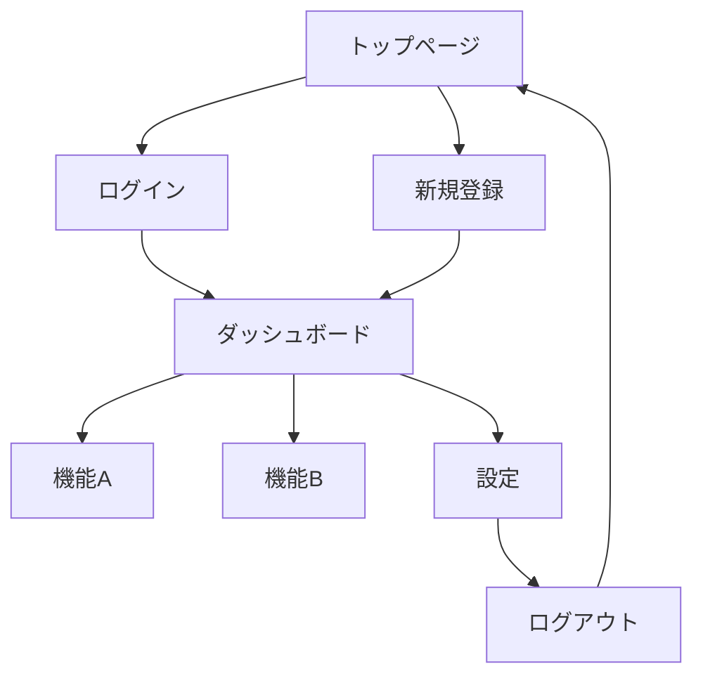

# 画面遷移

このドキュメントでは、画面間の遷移フローを定義します。

## 画面遷移図

（実際のプロジェクトに合わせて更新してください）

---

## 遷移一覧

| ID | 遷移元 | 遷移先 | トリガー | 条件 |
|----|--------|--------|---------|------|
| NAV-001 | トップページ | ログイン | ログインボタンクリック | 未認証 |
| NAV-002 | ログイン | ダッシュボード | ログイン成功 | 認証成功 |
| NAV-003 | ... | ... | ... | ... |

---

## 認証状態による遷移制御

### 未認証ユーザー
アクセス可能:
- トップページ
- ログイン
- 新規登録
- パスワードリセット

アクセス不可（ログインへリダイレクト）:
- ダッシュボード
- 設定
- その他の認証必要ページ

### 認証済みユーザー
アクセス可能:
- すべてのページ

リダイレクト:
- ログイン → ダッシュボードへリダイレクト
- 新規登録 → ダッシュボードへリダイレクト

---

## 遷移時のデータ

### URLパラメータ
| 遷移 | パラメータ | 説明 |
|------|-----------|------|
| 詳細画面へ | `id` | リソースID |
| 検索結果へ | `q`, `page` | 検索クエリ、ページ番号 |

### 状態の引き継ぎ
| 遷移 | 引き継ぐ状態 | 方法 |
|------|-------------|------|
| フォーム → 確認 | 入力内容 | State管理 |
| 一覧 → 詳細 → 一覧 | スクロール位置 | State管理 |

---

## エラー時の遷移

| エラー | 遷移先 | 表示内容 |
|--------|--------|---------|
| 401 Unauthorized | ログイン | セッション切れメッセージ |
| 403 Forbidden | エラーページ | アクセス権限なしメッセージ |
| 404 Not Found | 404ページ | ページが見つかりません |
| 500 Server Error | エラーページ | システムエラーメッセージ |

---

## ディープリンク

### 対応URL
| パス | 画面 | パラメータ |
|------|------|-----------|
| `/` | トップページ | - |
| `/login` | ログイン | `redirect`: 戻り先 |
| `/dashboard` | ダッシュボード | - |
| `/items/:id` | アイテム詳細 | `id`: アイテムID |

### ブックマーク対応
- すべての主要画面はURLで直接アクセス可能
- 認証が必要な場合はログイン後に元のURLへリダイレクト
