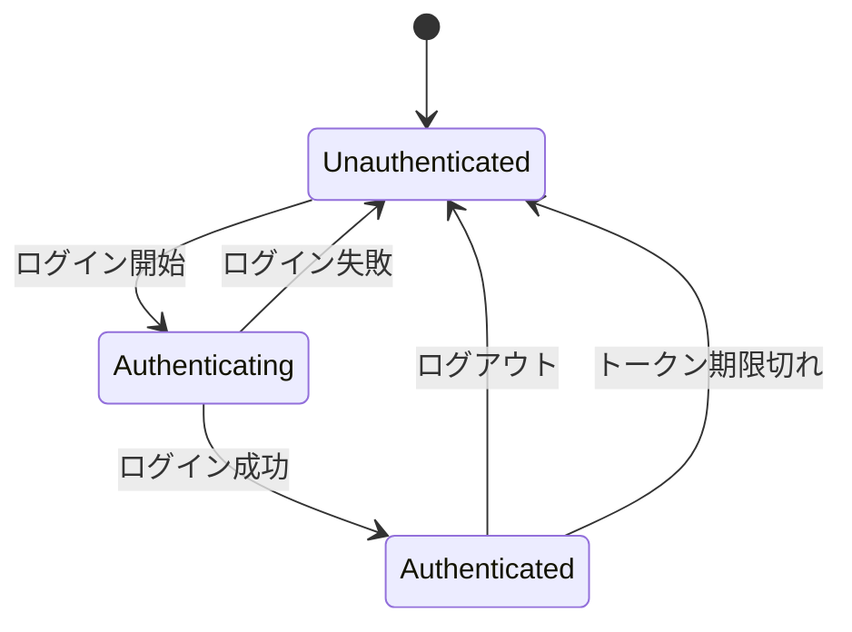

# 状態管理

このドキュメントでは、アプリケーションの状態管理方針を定義します。

## 状態管理方針

### 使用する状態管理手法
（例: React Context, Redux, Zustand, Jotai など）

### 選定理由
- （理由を記述）

---

## 状態の分類

| 分類 | 説明 | 管理方法 |
|------|------|---------|
| サーバー状態 | APIから取得するデータ | （例: React Query, SWR） |
| クライアント状態 | UIの状態（モーダル開閉等） | （例: useState, Context） |
| グローバル状態 | 複数コンポーネントで共有 | （例: Redux, Zustand） |
| URL状態 | URLパラメータ、クエリ | Router |
| フォーム状態 | フォーム入力値 | （例: React Hook Form） |

---

## グローバル状態の構造

```typescript
// 例: グローバルストアの構造
interface GlobalState {
  // 認証状態
  auth: {
    isAuthenticated: boolean;
    user: User | null;
    token: string | null;
  };

  // UI状態
  ui: {
    sidebarOpen: boolean;
    theme: 'light' | 'dark';
  };

  // 通知
  notifications: Notification[];
}
```

---

## 状態遷移

### 認証状態


### その他の状態遷移
（プロジェクト固有の状態遷移を記述）

---

## データフェッチング

### キャッシュ戦略
| データ種別 | キャッシュ時間 | 再検証タイミング |
|-----------|---------------|-----------------|
| ユーザー情報 | 5分 | フォーカス時 |
| マスタデータ | 1時間 | 手動 |
| リスト | 1分 | フォーカス時、ミューテーション時 |

### 楽観的更新
- 更新系操作は楽観的更新を使用
- エラー時はロールバック

---

## 永続化

### ローカルストレージ
| キー | 内容 | 有効期限 |
|-----|------|---------|
| `auth_token` | 認証トークン | トークン期限に依存 |
| `theme` | テーマ設定 | なし |
| `preferences` | ユーザー設定 | なし |

### セッションストレージ
| キー | 内容 |
|-----|------|
| `form_draft` | フォームの下書き |

---

## パフォーマンス考慮事項

### メモ化
- 重い計算は `useMemo` でメモ化
- コールバックは `useCallback` でメモ化
- コンポーネントは必要に応じて `React.memo`

### 状態の粒度
- 必要以上に大きな状態を作らない
- 頻繁に更新される状態は分離

### 不要な再レンダリングの防止
- セレクタを使用して必要な状態のみ購読
- 状態の正規化
